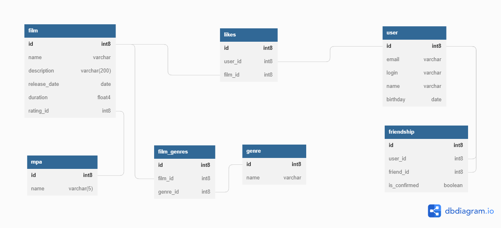

# Filmorate

ER-диаграмма:


Диаграмма отражает способ хранения в БД основных сущностей приложения Filmorate. В БД все таблицы имеют связь один ко
многим. Таблица friendship служит для хранения информации о друзьях пользователей. Таблица likes хранит информацию о
лайках поставленных фильмам и о id пользователей, которым фильм понравился. Таблица film_genres используется для связи
фильмов и жанров к которым фильм принадлежит. Таблицы genre и rating служат для хранения информации и жанре и рейтинге
фильма.

### Примеры запросов, использующихся для реализации основных функций приложения

1. Получение информации о пользователе по id

```
SELECT *
FROM user
WHERE id = ?
```

2. Получение информации о фильме по id

```
SELECT *
FROM film
WHERE id = ?
```

3. Получение списка друзей пользователя

```
SELECT friend_id
FROM friendship
WHERE user_id = ?
```

4. Получение 10-ти фильмов с наивысшим рейтингом

```
SELECT film_id,
       COUNT(user_id) likes_quantity
FROM likes
GROUP BY film_id
ORDER BY likes_quantity DESC
LIMIT 10
```